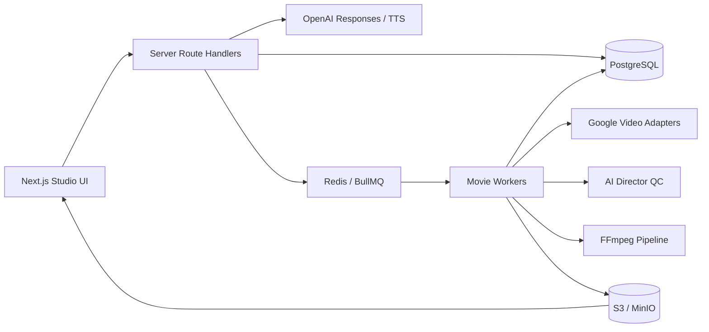

# CineForge — автономная AI Movie Studio

CineForge превращает один замысел в восстанавливаемый Movie Project:

`идея → MoviePlan → Character / Location Bible → Scene Graph → shots → Google video generation с нативным звуком → AI Director QC → timeline → FFmpeg → MP4/MOV`

Это не отправка «60 минут» одним запросом. Фильм разбивается на короткие shots с зависимостями, checkpoints, idempotency keys, версиями и отдельными media assets. Готовые части никогда не генерируются повторно без изменения их content hash.

## Загрузка на GitHub

Папка проекта подготовлена для GitHub Web Upload и содержит меньше 100 файлов. Загружайте содержимое папки `cineforge`, включая `.gitignore`, но никогда не добавляйте `node_modules`, `.next`, `.env` или локальные media из `storage`. После клонирования зависимости и production build восстанавливаются командами `pnpm install` и `pnpm build`.

## Windows desktop application

CineForge собирается как настоящее 64-bit Windows-приложение на Electron с локально упакованным интерфейсом Next.js. Оно запускается без браузерной панели, использует системные диалоги сохранения файлов и хранит адрес backend только в профиле Windows. Renderer работает с `contextIsolation`, Chromium sandbox, отключённым `nodeIntegration` и запретом произвольных окон/permissions.

```powershell
pnpm install
pnpm desktop:unpacked
```

Готовое приложение появляется в `release/win-unpacked/CineForge.exe`. Команда `pnpm desktop:build` дополнительно создаёт NSIS installer, если он понадобится. На первом запуске Windows-клиент запрашивает HTTPS URL облачного CineForge backend из `render.yaml`; после подключения Google/OpenAI keys добавляются в **Settings → API** и не встраиваются в `.exe`.

Desktop-клиент и облачный Movie Engine разделены намеренно: закрытие Windows-приложения не останавливает background worker, checkpoints и уже подтверждённые video jobs. Без интернета невозможно обращаться к Google/OpenAI API, а без облачного backend невозможно продолжать рендер при выключенном компьютере.

## Постоянный хостинг на Render.com

В корне находится `render.yaml`: Render Blueprint создаёт Web Service, отдельный Background Worker, PostgreSQL 17, persistent Key Value для BullMQ и MinIO с 50 GB persistent disk. Docker-образ устанавливает FFmpeg/ffprobe. Поэтому сайт, checkpoints и генерация продолжают работать в облаке, когда локальный компьютер выключен.

1. Загрузите репозиторий на GitHub.
2. В Render откройте **New → Blueprint**, подключите репозиторий и подтвердите ресурсы из `render.yaml`.
3. После первого запуска откройте публичный URL `cineforge-web`.
4. В приложении откройте **Settings → API** и сохраните новые Google/OpenAI keys. Они шифруются общим автоматически созданным `APP_ENCRYPTION_KEY` и хранятся в PostgreSQL; ключи не нужно добавлять в GitHub или Blueprint.

Конфигурация использует платные `starter`/`basic` ресурсы: бесплатный web service может засыпать, бесплатный PostgreSQL ограничен по сроку, а background worker и persistent disk требуют платного плана. Перед подтверждением Blueprint проверьте актуальную итоговую стоимость в Render Dashboard. MinIO S3 API имеет публичный TLS endpoint для подписанных media URLs, но сами объекты доступны только по временным signed URLs или с автоматически созданными credentials.

## Что реализовано

- Next.js 16 / React 19 / TypeScript, server-only provider adapters.
- Отдельный AI Screenwriter и AI Director на OpenAI Responses API: streaming, история, project context, изображения, Structured Outputs, task model routing.
- Google Model Adapter Layer:
  - `gemini-omni-flash-preview` через Interactions API;
  - `veo-3.1-generate-preview`;
  - `veo-3.1-fast-generate-preview`;
  - `veo-3.1-lite-generate-preview`;
  - обнаружение дополнительных video-моделей через Models API. Неизвестная модель показывается как discovered, но остаётся недоступной для генерации до появления проверенного capability adapter.
- Зависимые от модели resolution, duration, aspect ratio, references и приблизительная per-second стоимость.
- Project Memory: Character Bible, Voice Bible, Wardrobe Memory, Location Bible, locks, structured continuity state и reference IDs.
- Model-specific prompt adapters для Veo и Omni.
- PostgreSQL Scene Graph: Movie → Acts → Sequences → Scenes → Shots → Versions → Assets → Timeline → Exports.
- BullMQ / Redis background jobs, enforced dependency graph, idempotency, bounded retries, pause/resume, transactional budget reservations и recovery после worker restart.
- Checkpoint после каждого принятого shot; completed shots исключаются из resume.
- Reference image loader и передача final frame предыдущего shot как first-frame reference, когда выбранная модель это поддерживает.
- AI Director QC каждого shot по metadata и representative frame. Низкий score улучшает prompt и ставит только этот shot на ограниченный retry.
- Нативная речь Google сохраняется вместе с мимикой, эмоцией и синхронизацией губ; Voice Bible повторяет тембр, возраст, акцент, ритм и манеру речи персонажа в каждом следующем запросе. `gpt-4o-mini-tts` используется только для точечного недеструктивного исправления уже готовой реплики.
- Non-destructive editor: timestamp/scene impact analysis, dialogue-only patch без перекодирования video stream и отдельные shot versions.
- FFmpeg normalisation: 24 fps, фиксированное разрешение, H.264, AAC 48 kHz, loudness `-16 LUFS`, `faststart`.
- Final QC: ffprobe integrity, video/audio stream, resolution, FPS, sample rate, black-frame scan, maximum audio level и duplicate asset checks.
- MP4/MOV assembly, SRT, Markdown screenplay и JSON project archive.
- S3-compatible object storage; PostgreSQL хранит metadata и object keys, а не video blobs.
- AES-256-GCM key vault, masked key hints, signed URLs, validated uploads и rate limiting.
- Профессиональный интерфейс: Project Library, Create Movie, AI Screenwriter, Characters, Locations, Editor, Renders, Settings.

## Актуальные API, проверенные 23 августа 2026

Реестр capabilities в [`src/domain/video-models.ts`](src/domain/video-models.ts) основан только на официальной документации.

| Система | Использование |
|---|---|
| Google Models | `GET https://generativelanguage.googleapis.com/v1beta/models` |
| Google Veo | официальный `@google/genai` `models.generateVideos()`, REST-операция `models/{model}:predictLongRunning` |
| Gemini Omni | `POST https://generativelanguage.googleapis.com/v1beta/interactions` с `response_format.type = video` |
| OpenAI | `POST /v1/responses`, streaming и Structured Outputs |
| OpenAI TTS | `POST /v1/audio/speech`, модель `gpt-4o-mini-tts` |

Официальные источники:

- [Google Veo API](https://ai.google.dev/gemini-api/docs/veo)
- [Gemini Omni](https://ai.google.dev/gemini-api/docs/omni)
- [Google Models API](https://ai.google.dev/api/models)
- [Google Gemini API pricing](https://ai.google.dev/gemini-api/docs/pricing)
- [Google rate limits](https://ai.google.dev/gemini-api/docs/rate-limits)
- [OpenAI Models](https://developers.openai.com/api/docs/models)
- [OpenAI Responses API](https://developers.openai.com/api/reference/resources/responses/methods/create)
- [OpenAI text-to-speech](https://developers.openai.com/api/docs/models/gpt-4o-mini-tts)

Google Models API не возвращает «оставшуюся квоту» аккаунта. CineForge честно показывает `quota: unavailable via API` и направляет в Google AI Studio; приложение не вычисляет вымышленный остаток.

## Быстрый запуск

Требования:

- Node.js 22+ и pnpm 11+;
- PostgreSQL 17, Redis 7 и S3-compatible storage;
- FFmpeg и ffprobe в `PATH`;
- Docker Compose — рекомендуемый способ поднять локальную инфраструктуру.

```powershell
Copy-Item .env.example .env
node -e "console.log(require('crypto').randomBytes(32).toString('hex'))"
```

Запишите результат второй команды в `APP_ENCRYPTION_KEY`. Затем:

```powershell
docker compose up -d
pnpm install
pnpm db:migrate
pnpm dev
```

Во втором терминале:

```powershell
pnpm worker
```

Откройте [http://localhost:3000](http://localhost:3000).

Для production-сборки `pnpm build && pnpm start` запускает Next.js standalone server; build-скрипт автоматически переносит `public` и `.next/static` в standalone bundle.

### API keys

Вариант 1 — server environment:

```dotenv
OPENAI_API_KEY=
GEMINI_API_KEY=
```

Вариант 2 — `Settings → API`. Ключ отправляется только в server Route Handler, проверяется у провайдера, шифруется AES-256-GCM и сохраняется в PostgreSQL. После сохранения поле очищается, API возвращает только masked hint. Ни одна переменная ключа не имеет префикса `NEXT_PUBLIC_`.

Если ключ когда-либо был опубликован в сообщении, issue, скриншоте или Git, отзовите его у провайдера и создайте новый. Не считайте такой ключ безопасным даже после удаления текста.

## Рабочий поток

1. `Settings → API`: подключить Google и OpenAI, выполнить Test Connection.
2. `Create Movie`: ввести идею, duration (1–3600 секунд), model, resolution, aspect ratio и Maximum generation budget.
3. `Plan movie`: OpenAI возвращает строгий `MoviePlan`; adapters создают model-specific prompts; состояние сохраняется транзакционно.
4. Проверить approximate cost. Если estimate выше budget, paid generation заблокирована.
5. `Confirm paid generation`: idempotent jobs поступают в очередь. Независимые shots выполняются параллельно, зависимые ждут references.
6. Уже созданные clips доступны через `/api/projects/{id}/preview` во время генерации.
7. При quota/rate-limit/network failure проект не обнуляется. `Resume` продолжает с unfinished shot IDs.
8. `Editor`: AI edit сначала строит Impact Analysis. Dialogue edit создаёт только новую audio/video-container version; visual edit ставит в очередь только affected shot.
9. После последнего video/dialogue checkpoint Movie Engine автоматически ставит MP4 assembly и Final QC в очередь. `Export` в Editor создаёт новый master после последующих правок. Только прошедший QC файл становится `final_movie_storage_key`.

## Архитектура



Три независимых уровня:

1. **ChatGPT Brain** — сценарий, dialogue, shot intent, targeted edits, prompt engineering и QC reasoning.
2. **Video Generation Engine** — Google Veo / Gemini Omni adapters.
3. **Movie Engine** — memory, continuity, queue, versions, checkpoints, точечная коррекция аудио, FFmpeg, export и recovery.

## Надёжность

- `jobs.idempotency_key` и Bull job IDs предотвращают двойную генерацию.
- `contentHash(prompt + references + audio + settings)` включает все generation inputs.
- API operation ID сохраняется на shot; worker restart переводит interrupted jobs обратно в очередь.
- Запрошенные 10/30/60 секунд разбиваются на допустимые для выбранной модели chunks: Omni использует документированный диапазон до 10 секунд за interaction, Veo — 4/6/8 секунд. Сборщик обрезает каждый источник по плану и проверяет точную длительность master-файла с допуском 0,5 секунды.
- «Быстрый черновик» реально переключает выбранный Veo 3.1 на официальный `veo-3.1-fast-generate-preview`, а для 10 секунд использует готовый однокадровый экспресс-план без ожидания длинного сценарного прохода. Короткий Omni-результат принимается напрямую без промежуточного ожидания Google Files, нативный звук не заменяется отдельным TTS, а совместимые 24 FPS кадры не перекодируются при сборке. Целевое время такого пути — до 3 минут, но фактическое время ответа внешней очереди Google приложение гарантировать не может.
- Quota и maximum budget переводят проект в `paused`, а не `failed` и не удаляют assets; параллельные jobs сначала атомарно резервируют стоимость в PostgreSQL, поэтому вместе не могут превысить лимит.
- Retry policy различает quota, rate limit, timeout, server, moderation, corrupted media, upload и fatal error.
- Retry ограничен `MAX_AUTO_RETRIES`; бесконечных циклов нет.
- Каждая активная версия shot хранится отдельно; предыдущие versions остаются доступными.
- Project A/B изолированы `workspace_id`, `project_id`, `conversation_id`, `scene_id`, `shot_id`.

## Команды проверки

```powershell
pnpm typecheck
pnpm lint
pnpm test
pnpm build
```

Тесты покрывают checkpoints, resume, non-destructive editing, Project Memory, continuity state, API failure policy, caching и dependency-aware idempotent queue.

## Production hardening

Локальная конфигурация является single-workspace. Перед публичным multi-user deployment добавьте внешний authentication/authorization layer и замените process-local HTTP limiter на distributed Redis limiter. Используйте managed PostgreSQL, private Redis, versioned object bucket, KMS-managed `APP_ENCRYPTION_KEY`, HTTPS, backup policy и worker autoscaling. Не используйте пароли MinIO из `docker-compose.yml` в production.

## Реальные ограничения

- Доступность preview model IDs зависит от Google project, региона и allowlist. UI отключает model, отсутствующую в ответе Models API.
- Google video models создают короткие clips; длинный фильм может означать сотни платных generations и длительный background render.
- Reference assets и continuity QC существенно уменьшают drift, но закрытая video model не даёт математической гарантии идентичности каждого пикселя.
- Omni editing имеет региональные и feature-ограничения, описанные в официальной документации. Adapter не показывает неподдерживаемые controls.
- Стоимость до запуска приблизительна: retries, moderation, provider billing rounding и изменение pricing заранее неизвестны. Budget limit остаётся жёстким приложенческим барьером.
- Veo показывает только нативно поддерживаемые режимы. Для Omni 1080p/4K честно обозначены как разрешения финального Movie Engine export: сам Omni не принимает параметр resolution и возвращает короткий 720p-class source, поэтому увеличение размера не создаёт дополнительных деталей.
